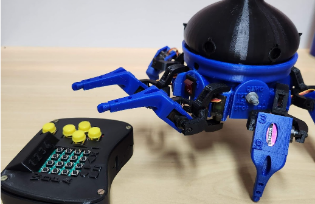

# Hexapod

    

> Robô hexapod azul para demonstrações de robótica e locomoção com múltiplas pernas.

<p align="center">
  
</p>

## Sumário

- [Visão geral](#visão-geral)
- [Objetivos](#objetivos)
- [Principais recursos](#principais-recursos)
- [Arquitetura do projeto](#arquitetura-do-projeto)
- [Hardware](#hardware)
- [Software](#software)
- [Estrutura do repositório](#estrutura-do-repositório)
- [Como usar](#como-usar)
- [Aplicação em divulgação científica](#aplicação-em-divulgação-científica)
- [Referências](#referências)

## Visão geral

Um robô hexapod é um robô móvel com seis pernas, inspirado na estabilidade e na locomoção de insetos. No contexto da Robotnik, o projeto é uma plataforma de estudo e demonstração de robótica, permitindo apresentar conceitos de cinemática, controle de servomotores, montagem mecânica, eletrônica embarcada e programação.

Este repositório faz parte da organização **Robotnik - DAINF-PB**, projeto de extensão do DAINF da UTFPR - Campus Pato Branco voltado à robótica, prototipagem e divulgação científica.

## Objetivos

- Documentar a montagem e a organização do robô hexapod utilizado pela Robotnik.
- Registrar componentes, arquivos 3D, dependências e referências do projeto.
- Facilitar manutenção, reaproveitamento do protótipo e continuidade por novos integrantes.
- Servir como material de apoio em demonstrações de divulgação científica.

## Principais recursos

- Locomoção com seis pernas e movimentos inspirados em insetos.
- Estrutura com peças impressas em 3D.
- Controle de múltiplos servomotores.
- Potencial para demonstrações em escolas, feiras e eventos acadêmicos.

## Arquitetura do projeto

A arquitetura pode ser entendida em quatro camadas principais:

| Camada | Função |
|---|---|
| Mecânica | Estrutura física, peças impressas em 3D, suportes e montagem. |
| Eletrônica | Microcontroladores, sensores, atuadores, alimentação e conexões. |
| Software embarcado | Código de controle, leitura de entradas, processamento e acionamento. |
| Demonstração | Uso do protótipo em oficinas, feiras, escolas e eventos de divulgação. |

## Hardware

- Estrutura mecânica impressa em 3D
- Servomotores
- Microcontrolador compatível com o código do projeto
- Fonte/bateria adequada ao consumo dos servos
- Jumpers, conectores e suporte mecânico

## Software

- C++
- Ambiente Arduino/compatível, conforme configuração do repositório
- Bibliotecas de controle de servomotores

## Estrutura do repositório

- `STL Extras/ - arquivos extras para impressão 3D`
- `STL Root/ - arquivos principais de impressão 3D`
- `Vorpal-Hexapod-Robot/ - base do projeto`
- `README.md - documentação principal`
- LICENSE - licença MIT

## Como usar

> Esta seção deve ser ajustada conforme a versão atual do código e dos arquivos do repositório.

1. Clone o repositório:

```bash
git clone https://github.com/DAINF-PB-Robotnik/Hexapod.git
cd Hexapod
```

2. Confira as pastas de código, peças, esquemáticos e documentação.
3. Instale as dependências necessárias para o ambiente usado no projeto.
4. Faça a montagem elétrica e mecânica seguindo as conexões documentadas.
5. Carregue o código no microcontrolador ou execute o software principal.
6. Teste por etapas antes de usar o protótipo completo.

## Aplicação em divulgação científica

O projeto pode ser usado em atividades de extensão para apresentar conceitos de robótica e engenharia de forma visual e prática. Em eventos, oficinas e visitas técnicas, o protótipo ajuda a conectar assuntos como programação, eletrônica, sensores, impressão 3D, controle e resolução de problemas com uma demonstração concreta.

## Continuidade do projeto

Sugestões para evolução:

- Atualizar a documentação com fotos reais da montagem.
- Adicionar diagramas de ligação elétrica.
- Registrar vídeos curtos de funcionamento.
- Criar uma seção de problemas comuns e soluções.
- Padronizar nomes de arquivos e dependências.
- Adicionar instruções de segurança para alimentação, motores e partes móveis.
- Criar uma versão em artigo técnico a partir do arquivo LaTeX deste pacote.

## Referências

- Vorpal Robotics - Vorpal The Hexapod Assembly Instructions
- Teaching Tech - VORPAL Hexapod Assembly Guide Part 1
- Thingiverse - Vorpal The Hexapod Walking Robot

VORPAL ROBOTICS (Estados Unidos). Vorpal The Hexapod Assembly Instructions. 2018. Disponível em: https://vorpalrobotics.com/wiki/index.php/Vorpal_The_Hexapod_Assembly_Instructions. Acesso em: 8 ago. 2022.

VORPAL Hexapod Assembly Guide Part 1 - Robot. Stockholm: Teaching Tech, 2018. (25 min.), son., color. Disponível em: https://www.youtube.com/watch?v=cf1dBCwsE0o. Acesso em: 8 ago. 2022.

VORPAL ROBOTICS (Estados Unidos). Vorpal The Hexapod Walking Robot. 2017. Hospedado em UltiMaker Thingiverse. Disponível em: https://www.thingiverse.com/thing:2513566. Acesso em: 8 ago. 2022.

ROBOTICS, Vorpal. Vorpal The Hexapod Walking Robot. 2017. Hospedado em Dropbox. Disponível em: https://www.dropbox.com/sh/0stxwsw918kfwa3/AADD3QPzPoBBowBSvhDh1UINa/STL/A-HEXAPOD/ROBOT?dl= 0 & subfolder_nav_tracking=1. Acesso em: 8 ago. 2022.
